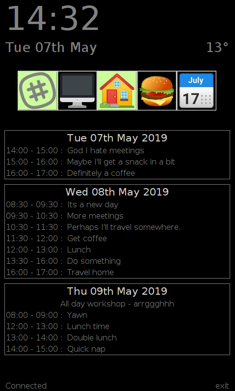

# Work status board

A simple touchscreen status board for the Raspberry Pi touchscreen which shows the time and calendar and allows me to view and update my slack status



## Install

### Clone the repo

```
git clone https://github.com/martinohanlon/work-status
```
### Python modules

```
pip3 install --upgrade google-api-python-client google-auth-httplib2 google-auth-oauthlib slackclient==1.3.1 websockets guizero pyowm pillow==5.4.1
```

### Slack api token

Visit [api.slack.com/custom-integrations/legacy-tokens](https://api.slack.com/custom-integrations/legacy-tokens) and create a Slack legacy api key/token for your account.

Visit [openweathermap.org/api](https://openweathermap.org/api) and sign up for an API key/token.

### Rotate the screen

The status board is designed to be viewed in portrait. Follow this [guide to rotate the touchscreen](https://www.stuffaboutcode.com/2017/05/raspberry-pi-touchscreen-portrait.html).

## Run

```
cd work-status
python3 status.py
```

The first time you run the program it prompts you to enter your open weather maps and slack api tokens before being taken to a webpage to sign into google and authorise the application to use your calendar.

## Config

The board can be modified by changing the `# config` section at the top of the `status.py` program. 
